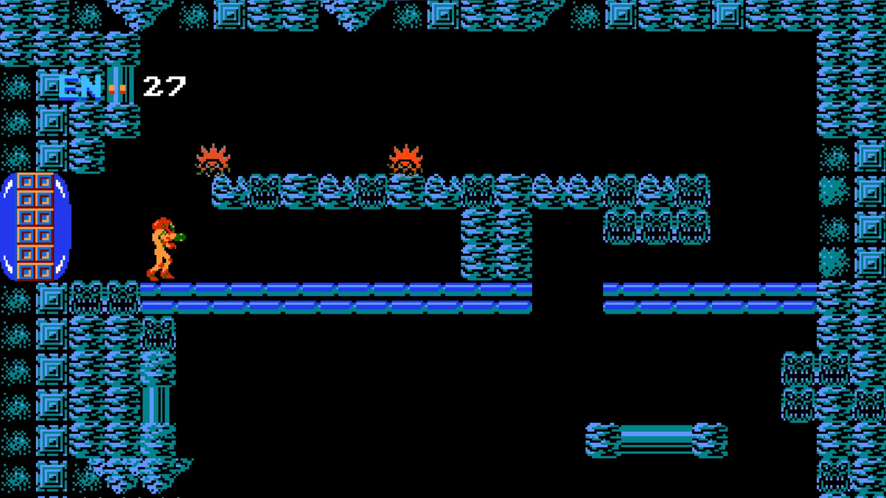
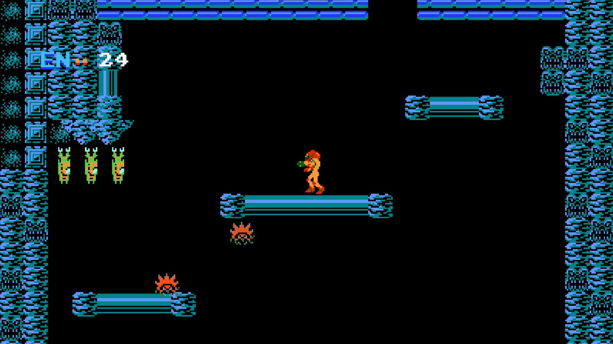
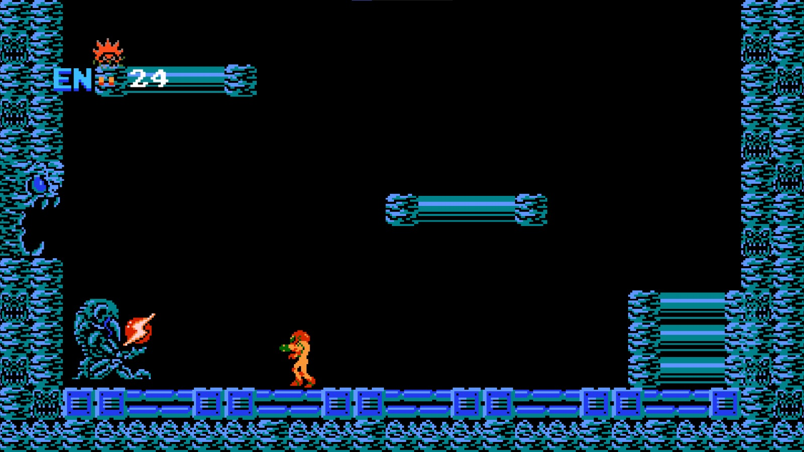
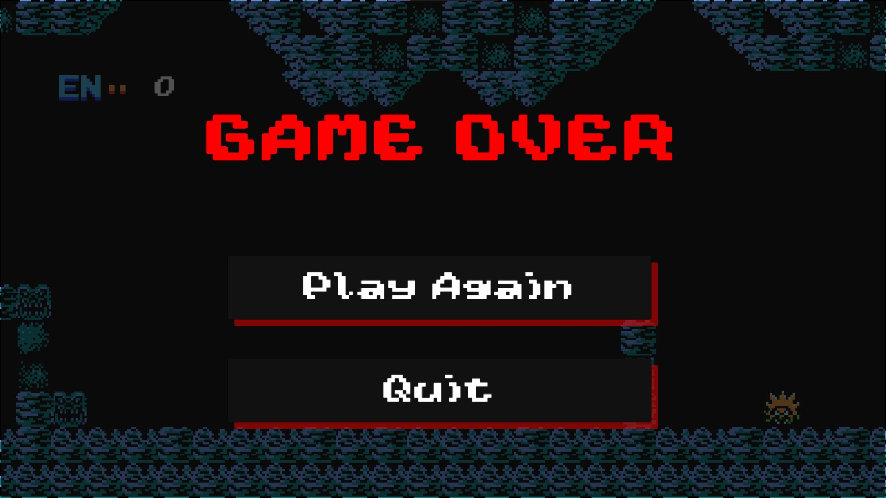

<h1 align="center">
  
  
 

  </h1>
<h3 align="center">  
  
  An remake of Nintendo`s masterpice origin Metroid using Unity & C#
  </h3>
  
## Table Of Content

- [General](#general)
- [Installation](#installation)
- [How To Play](#howtoplay)
- [Screenshots](#screenshots)
- [Credits](#credits)  

## General

The game was created as part of "Game Development Foundations course" by [NotSlot](https://github.com/notslot) within my Computer Science B.Sc.  
The original assignment was to recreate an 1980s video game.  
I personally choose Metroid as i truly belive that this game had a major influence on video games devolopment.  
  
**I strongly suggest to check the light mod that I created following this project - [MetroidLightMod](https://github.com/ArnonGuttel/MetroidLightMod)** 

## Installation

- Windows:      
  - &emsp; Download the [WindowsBuild](https://github.com/ArnonGuttel/MetroidRemake/tree/main/WindowsBuild) folder 
  - &emsp; Run the Breakout.exe executable file.
 
 - Mac
   - &emsp; Download the [MacBuild](https://github.com/ArnonGuttel/MetroidRemake/tree/main/MacBuild.app/Contents) folder 
   - &emsp; Run the  Mac Build.app_ package

## How&nbsp;To&nbsp;Play
- Arrow key's to move
- Down arrow key to start/stop roll (once roll powerup taken)
- 's' key to fire
- 'esc' key to pause 

## Screenshots

  <h3>Gameplay:</h3>

  
  
  
  

  <h3>Pause Menu:</h3>
  
  
  <h3>Game over:</h3>
  

## Credits 
- Banner Logo - [DivineArt](https://www.deviantart.com/imleerobson/art/Metroid-Title-Screen-Vector-Logo-1987-703268172)
- Sprites - [Spriters-Resource](https://www.spriters-resource.com/nes/metroid/)
- Sound Effects - [Sounds-Resource](https://www.sounds-resource.com/nes/metroid/sound/4866/)
